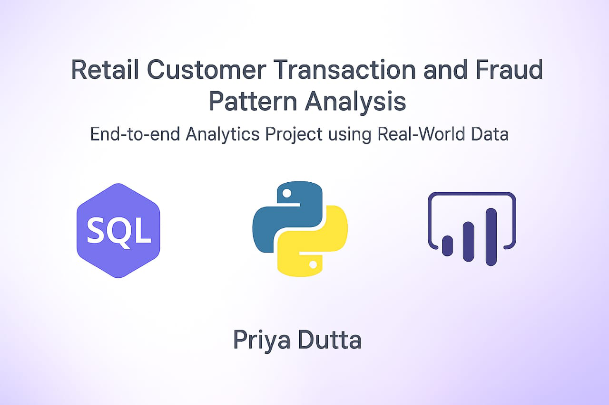

  

# Retail Customer Transaction & Fraud Pattern Analysis

### 📌 Business Case
This project simulates a **real-world retail/fintech scenario** with a focus on analyzing customer transactions and uncovering fraud patterns.  
The primary objectives were to:
- Analyze suspicious patterns 🚨
- Identify high-revenue customers and merchants
- Visualize KPIs for revenue, transactions, and fraud trends

---

### 🧰 Tools Used
- **SQL (MS SQL Server)** – Data cleaning, joins, aggregations, fraud pattern queries
- **Power BI** – Interactive dashboards (KPIs, filters, fraud visuals)
- **Python (Pandas, Seaborn, Matplotlib)** – Fraud pattern analysis, heatmaps, and visual trends

---

### 📂 Project Components:

| File/Folder | Description |
|-------------|-------------|
| `📁 Raw_Data/` | Original source data – `customers.csv`, `transactions.csv`, `merchants.csv` |
| `📁 Cleaned_Data/` | Final cleaned & merged file – `Customer_Transaction_Merged_Cleaned.csv` |
| `Retail_Insights_SQL_Priya_Dutta.sql` | SQL queries for EDA & fraud analysis |
| `Retail_Customer_Transaction_and_Fraud_Pattern_Analysis_SQLQueries_Priya_Dutta.txt` | SQL queries for EDA & fraud analysis in text format|
| `Retail_Insights_Fraud_Analysis.txt` | EDA insights summary from SQL analysis |
| `Retail_Fraud_Insights_Detailed.txt` | In-depth fraud analysis report |
| `Retail_Insights_with_Fraud_Analysis_Priya_Dutta.pbix` | Final Power BI dashboard |
| `Retail_Insights_with_Fraud_Analysis_Priya_Dutta.pdf` | Exported PDF of Power BI dashboard |
| `Retail_Fraud_Transaction_Analysis_Priya_Dutta.ipynb` | Python notebook (fraud pattern analysis & heatmap) |
| `Retail_Fraud_Transaction_Analysis_Priya_Dutta.pdf` | Exported PDF of Python notebook |
| `README.md` | Project overview, resume lines, and interview pitch |
| `LICENSE` | Proprietary License (All Rights Reserved) |
| `Retail_Customer_Transaction_and_Fraud_Pattern_Analysis_Banner.png` | GitHub project banner (displayed in repo) |
| `Retail_Fraud_Analysis_Carasoul.pdf` | Project Summary PDF (Github presentation) |

---

📲 **Note:** PDF preview may not load on mobile. Please download to view full report.

---

### 💡 Key Features:
- Total Revenue, Orders, and Avg Transaction KPIs  
- Fraud analysis by region, payment method, city, category  
- Top 5 customers & merchants  
- Heatmap🔥- Category*Region (Python)  
- Interactive filters for deeper insights  

---

### 🗂️ SQL Analysis Summary
- Total Transactions: **7,500**
- Total Revenue: **₹19.15 Cr**
- Fraud Transactions: **364 (4.8%)**
- Highest Revenue Region: **East (₹5.15 Cr)**
- Top Customer: **CUST0387**
- Fraud-Prone Payment Types: **Netbanking & Wallets**

---

### 📊 Power BI Dashboard Pages
1. **Business Overview** – KPIs: Total Revenue, Transactions, Avg Transaction Value  
2. **Top Performers** – Top 5 Customers & Merchants by Revenue, Monthly Revenue Trend  
3. **Fraud Analytics** – Fraud counts by region, payment type, merchant category & cities  

---

### 🔎 About the `IsFraud` Column

The `IsFraud` column was already present in the dataset and served as a binary label:

- `1` = Fraudulent Transaction  
- `0` = Genuine Transaction

We did not generate this label using machine learning. Instead, this project focuses on **fraud pattern analysis using SQL, Power BI, and Python** to highlight suspicious activity, high-risk regions, and fraud-prone categories.  

---

> This allows the analysis to be extended later into predictive modeling when machine learning is incorporated.

---

### 🐍 Python Insights:
- Used pandas to load & clean merged dataset  
- Performed fraud analysis by Region
- Top 5 cities by Revenue  
- Visualized fraud % by Region (Seaborn)  
- Heatmap: Fraudulent transactions by Region & Category 🔥  

---

### 💼 Resume Description (2–3 lines):
> **Retail Customer Transaction and Fraud Pattern Analysis** using SQL, Python, and Power BI. Built an end-to-end project to analyze fraud patterns, top customers/merchants, and visualize insights through a dynamic dashboard.

---

### 🗣️ Interview Elevator Pitch:
> “This project simulates a real-world fintech scenario. I started with SQL to clean and analyze 7500 customer transactions. Then, I used Power BI to create a professional dashboard for decision-makers. Finally, I added a Python notebook for fraud analysis and visual exploration using Seaborn and Matplotlib. The project reflects how I can combine data engineering, analytics, and visualization tools to solve real business problems.”

---

### 📌 Why This Project Stands Out:
- ✅ End-to-end ownership of analysis → dashboard → insights  
- ✅ Realistic business goals: customer value + fraud risk  
- ✅ Great for GitHub, LinkedIn, and interview presentation  

---

### 📈 Sample Insights

> Based on 7,500 transaction records from 6 regions & 6 product categories:

- **Top Revenue Region**: East (₹5.15 Cr), followed by South and North  
- **Most Fraud-Prone Region**: West (5.05% fraud rate)  
- **Top Customer**: `CUST0387` with ₹6.24 Lakhs in spending  
- **High Fraud by Category**: Beauty and Home Decor  
- **Preferred Payment Methods**: Netbanking & Wallet showed higher fraud counts  
- **Fraud Risk Heatmap**: Visualized across category and region using Python  

---

### 📑 Project Summary Slides

You can view the complete walkthrough of this project in a concise, carousel-style PDF:

[🔗 Retail Customer Transaction & Fraud Pattern Analysis – Carousel Slides](https://github.com/duttapriya993/Retail_Customer_Transaction_and_Fraud_Pattern_Analysis_Priya_Dutta/blob/main/Retail_Fraud_Analysis_Carousel.pdf)

---

### 🧑‍💼 Author

**Priya Dutta**  
🎓 Executive Certification in Data Science with AI Specialization (IIT Guwahati via AnalytixLabs)  
🎓 MBA in Marketing & Finance  
📍 Betul, M.P. | Open to Remote Work & Relocation  
🔗 [LinkedIn Profile](https://www.linkedin.com/in/priya-dutta-b2541b14b)

---

### 💬 Resume Project Line

Developed an end-to-end retail customer transaction and fraud pattern analysis project using SQL, Python, and Power BI. Cleaned & joined multi-source data (7,500+ records), analyzed fraud trends, and built a dashboard showing region-wise revenue, top customers, and suspicious patterns.

---

### 🤖 AI Tools Used

I used ChatGPT while working on this project — mainly to get help in understanding queries, fixing errors, and writing some parts faster. Everything was checked and done by me with full understanding.

---

### 🔒 License  
This project is licensed under a **custom proprietary license**. Please refer to the [LICENSE](./LICENSE) file for detailed terms and usage restrictions.

